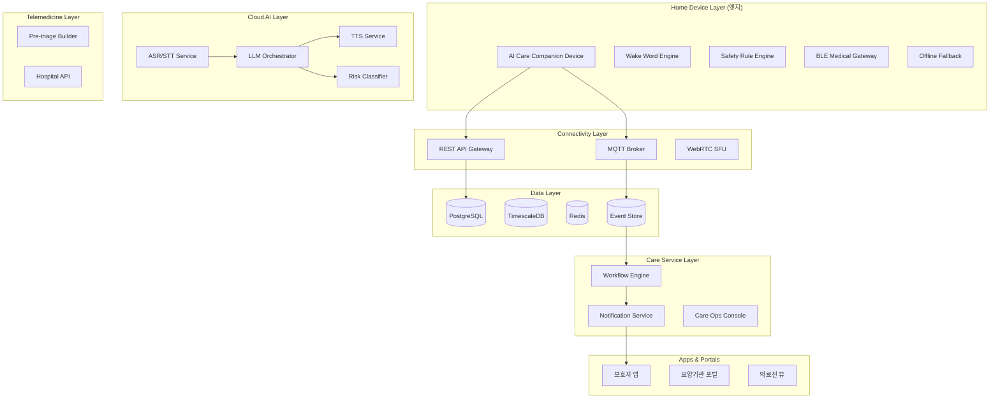
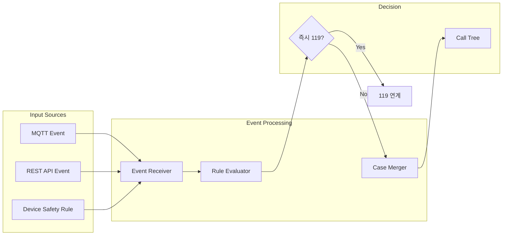

# AI Care Companion 백엔드 개발 계획

> **참고 문서**: `docs/아이부다마고치.pdf` - AI 독거노인 돌봄 디바이스 전체 아키텍처

## 프로젝트 개요

### 비전
**AI 장난감 → AI 케어 디바이스** (AI Companion → AI Care Companion)

독거노인 집에 설치하여 **24시간 AI 돌봄 + 원격 의료 연결** 역할을 수행하는 플랫폼

### 핵심 기능 10개
1. **AI 대화 친구** - 우울증 예방, 외로움 감소
2. **건강 상태 체크** - 매일 질문 및 데이터 저장
3. **약 복용 관리** - AI 알림 및 확인
4. **낙상 감지** - IMU/Radar/마이크 센서 기반
5. **활동 패턴 분석** - 수면, 식사 패턴 분석 및 이상 시 알림
6. **원격 진료 연결** - WebRTC 기반 의료 연결
7. **건강 데이터 수집** - BLE 혈압계/혈당계/SpO2 연동
8. **응급 상황 감지** - 위험 키워드 탐지 및 자동 알림
9. **보호자 앱** - 활동/건강/대화 로그 확인
10. **감정 케어** - 외로움/우울 감지 및 대응

---

## 시스템 아키텍처 (7 Layers)



---

## Phase 1: 프로젝트 초기화 및 인프라 ✅ 완료

### 1.1 완료된 작업
- [x] 프로젝트 디렉토리 구조 생성
- [x] Docker Compose 환경 (PostgreSQL+TimescaleDB, Redis, MQTT)
- [x] FastAPI 기본 앱 설정
- [x] SQLAlchemy 모델 (User, Device, Event, Policy 등)
- [x] 보안 유틸리티 (BCrypt, JWT, AES-256-GCM PII 암호화)
- [x] Alembic 마이그레이션 설정
- [x] 테스트 환경 구축

### 1.2 생성된 모델
| 도메인 | 테이블 |
|--------|--------|
| 사용자 | `care_user`, `care_user_pii`, `guardian`, `admin_user` |
| 기기 | `care_device` |
| 이벤트 | `measurement`, `care_event`, `care_case`, `case_action` |
| 알림 | `alert`, `notification_delivery` |
| 정책 | `policy_bundle`, `policy_threshold`, `escalation_plan`, `policy_rule` |

---

## Phase 2: Core REST API (사용자/기기/인증)

### 2.1 인증 API (`/api/v1/auth`)
- `POST /login` - 로그인 (JWT 발급, HttpOnly 쿠키)
- `POST /logout` - 로그아웃 (토큰 무효화)
- `POST /refresh` - 토큰 갱신
- `GET /me` - 현재 사용자 정보

### 2.2 사용자 관리 API (`/api/v1/users`)
- CRUD for `care_user`
- PII 암호화/복호화 처리
- 동의 상태 관리

### 2.3 보호자 관리 API (`/api/v1/guardians`)
- CRUD for `guardian`
- 콜 트리 우선순위 설정

### 2.4 기기 관리 API (`/api/v1/devices`)
- CRUD for `care_device`
- 상태 조회 (온라인/오프라인/유지보수)
- Heartbeat 처리

### 2.5 관리자 API (`/api/v1/admin`)
- Role 기반 접근 제어
- Audit Log 기록

---

## Phase 3: Event & Workflow Engine

### 3.1 이벤트 처리 흐름



### 3.2 케이스 병합 규칙
- **병합 키**: `(user_id, event_group, time_window)`
- 같은 사용자, "낙상/무활동/생체이상" 그룹, **30분 윈도우**면 같은 케이스로 합침
- 합칠 때: `care_case.linked_event_ids`에 event 추가

### 3.3 즉시 119 에스컬레이션 조건 (Hard Rule)
| 조건 | 트리거 |
|------|--------|
| 응급 키워드 발화 | "살려줘", "흉통", "호흡곤란", "숨이 차요" |
| SpO2 저하 | SpO2 < 90% **60초 이상 지속** + 호흡곤란 |
| 낙상 후 무응답 | 낙상 감지 + **60초 무동작** + 사용자 미응답 |
| SOS 버튼 + 미응답 | 응급 버튼 누름 + 확인 질문 미응답 |

### 3.4 구현 사항
- MQTT 이벤트 수신 워커 (aiomqtt)
- Rule Evaluator 서비스
- Case Merger 로직
- Background Worker (Celery 또는 asyncio)

---

## Phase 4: Policy Engine & Call Tree 스케줄러

### 4.1 콜 트리 단계별 설정

| Stage | 대상 | 타임아웃 | 채널 우선순위 | 다음 단계 조건 |
|-------|------|---------|--------------|---------------|
| Stage 1 | 보호자 1차 | 60초 | Push → 전화 | 미응답/실패 |
| Stage 2 | 보호자 2차 | 90초 | Push → 전화 | 미응답/실패 |
| Stage 3 | 요양보호사/기관 | 120초 | 전화 → Push | 미응답/실패 |
| Stage 4 | 관제센터/운영자 | 60초 | 전화 → 콘솔 | 미응답/실패 또는 위험도 HIGH+ |
| Stage 5 | 119 | 즉시 | 전화/연계 API | CRITICAL 조건 충족 |

### 4.2 Policy REST API (`/api/v1/policies`)
- `GET/POST /bundles` - 정책 번들 관리
- `GET/POST /thresholds` - 센서 임계치 설정
- `GET/POST /escalation-plans` - 콜 트리 설정
- `GET/POST /rules` - 복합 룰 관리 (JSON Schema 검증)

### 4.3 정책 룰 JSON 예시

```json
{
  "name": "즉시_119_SpO2_저하",
  "condition_type": "composite",
  "rule_json": {
    "operator": "AND",
    "conditions": [
      {"type": "threshold", "measurement": "spo2", "operator": "<", "value": 90},
      {"type": "duration", "seconds": 60},
      {"type": "keyword", "keywords": ["호흡곤란", "숨이 차"]}
    ]
  },
  "action_json": {
    "type": "immediate_escalation",
    "target": "119",
    "skip_stages": true,
    "notify_all_guardians": true
  },
  "is_emergency_rule": true
}
```

### 4.4 Escalation Scheduler
- APScheduler 또는 Celery Beat 기반
- 타임아웃 만료 시 다음 Stage로 자동 에스컬레이션
- 모든 액션 `case_action` 테이블 기록
- ACK 응답 처리 로직

---

## Phase 5: AI 서비스 통합

### 5.1 AI 파이프라인

```
음성 입력 → ASR(STT) → NLU/LLM → Response → TTS → 음성 출력
                ↓
         Risk Classifier
                ↓
         Emergency Detection
```

### 5.2 AI 모델 추천
| 기능 | 모델 | 비고 |
|------|------|------|
| STT | Whisper (tiny/small) | 스트리밍 가능 |
| LLM | Qwen / Gemma | 로컬 또는 클라우드 |
| TTS | VITS | 친근한 페르소나 |
| 위험 분류 | Custom Classifier | 증상+측정+패턴 |

### 5.3 LLM Orchestrator 기능
- 의도 분류: 대화/약복용/증상/응급/일상/기기제어
- 정책 기반 라우팅: 응급은 "설명"보다 "즉시 조치" 우선
- Conversation Memory (동의 기반, 최소화)
- 위험 키워드 탐지

### 5.4 프라이버시 원칙
- 원문 음성 저장 안 함 (또는 7일 이하, 동의 기반)
- PII 마스킹 후 LLM 전송
- 로컬 처리 우선 (엣지 디바이스)

---

## Phase 6: 보호자 앱 (Frontend)

### 6.1 핵심 화면
- **대시보드**: 오늘 상태 요약 (활동/수면/측정/알림)
- **알림 센터**: 긴급 알림 수신/확인
- **통화/영상**: 노인과 직접 연결
- **건강 기록**: 측정 데이터 트렌드
- **설정**: 복약 스케줄, 프라이버시 모드

### 6.2 기술 스택
- React Native 또는 Flutter
- Push Notification (FCM/APNs)
- WebRTC (영상 통화)

---

## Phase 7: 디바이스 연동

### 7.1 하드웨어 옵션
| 옵션 | 장치 | 장점 | 단점 |
|------|------|------|------|
| A안 | ESP32-S3 | 저렴/저전력/대량배포 | STT/비전 서버 의존 |
| B안 | Raspberry Pi | 온디바이스 AI 강화 | 원가/전력/발열 |

### 7.2 필수 센서/IO
- Mic Array (2~4ch) + Speaker
- 물리 버튼 (SOS/도움요청) + LED/디스플레이
- IMU (낙상/충격/움직임)
- (옵션) mmWave Radar (호흡/재실/낙상)
- (옵션) Camera (기본 OFF, 요청 시 ON)
- BLE (혈압계/혈당계/SpO2/체온계)

### 7.3 Edge Runtime 구성
- Wake Word Engine (로컬)
- Safety Rule Engine (로컬 1차 판단)
- Device State Machine (정상/주의/경고/응급/오프라인)
- BLE Medical Device Gateway
- Offline Fallback (네트워크 끊겨도 응급 대응)
- Privacy Switch (마이크 키워드만, 녹음 저장 금지)

### 7.4 통신 프로토콜
| 프로토콜 | 용도 |
|----------|------|
| MQTT | 상태/이벤트/Heartbeat (경량/실시간) |
| HTTPS/REST | 설정/정책/펌웨어/리포트 |
| WebRTC | 원격진료 음성/영상 |
| BLE | 혈압/혈당/SpO2 기기 연동 |

---

## Phase 8: 원격진료 연계 및 운영

### 8.1 원격진료 플로우
1. 사용자가 "의사 연결" 또는 위험도 높음으로 자동 제안
2. Pre-triage: 증상 체크리스트 + 측정데이터 묶음
3. 병원 시스템(원격진료 플랫폼)으로 예약/접수
4. WebRTC로 연결
5. 처방/지도/추적관리

### 8.2 문진(Triage) 질문 코드 예시
- `CHEST_PAIN`, `DYSPNEA`, `DIZZINESS`, `FEVER`, `COUGH`
- `ONSET_TIME`, `SEVERITY_SCALE`, `RECENT_FALL`
- `MEDICATION_TAKEN`, `ALLERGY`, `CHRONIC_DX`

### 8.3 운영 기능
- OTA 업데이트 (롤백 포함)
- 기기 원격 진단 (마이크/스피커 테스트)
- 장애 알림 (Heartbeat 끊김, 배터리 급감)
- A/B 정책 배포 (룰 변경, 알림 임계치 조정)

---

## MVP 스코프 (최소 기능 제품)

처음부터 전체 기능은 무겁습니다. **MVP 5개 기능**으로 시장 테스트:

| # | 기능 | 설명 |
|---|------|------|
| 1 | 음성 대화 + 안부 체크 | AI 대화, 기분/식사 확인 |
| 2 | 응급 버튼 + 콜 트리 | SOS 버튼, 단계별 알림 |
| 3 | 무활동 감지 | 레이더/IMU/마이크 기반 |
| 4 | BLE 혈압/SpO2 연동 | 건강 데이터 자동 수집 |
| 5 | 보호자 앱 | 상태/알림/통화 |

---

## 보안 체크리스트 (ISMS-P 수준)

- [x] PII 암호화 저장 및 분리 (`care_user_pii`)
- [x] JWT HttpOnly/Secure/SameSite 쿠키
- [x] 입력 검증 (백엔드 필수)
- [x] Role 기반 접근 제어 (Admin/Operator/Guardian)
- [x] 감사 로그 (Admin 액션 전체 기록)
- [x] 시크릿 관리 (환경변수/Secret Manager)
- [x] 로그에 민감정보 제외
- [ ] 디바이스 인증 (기기별 인증서)
- [ ] 전송 암호화 (TLS)
- [ ] 데이터 최소 수집 + 보관 기간 정책

---

## 비즈니스 모델

| 수익원 | 가격 |
|--------|------|
| 디바이스 판매 | 150~300$ |
| 월 구독 (AI 돌봄/모니터링) | 10~30$ |
| B2G 모델 (지자체 공급) | 독거노인 지원 사업 |

### 시장 규모
- 한국: 독거노인 **200만명**
- 세계: 고령 인구 **20억**

---

## 참고 자료

- **아키텍처 문서**: `docs/아이부다마고치.pdf`
- **PRD**: `docs/aiboocare_prd.md`
- pydantic-settings: https://docs.pydantic.dev/latest/concepts/pydantic_settings/
- SQLAlchemy 2.0 Async: https://docs.sqlalchemy.org/en/20/orm/extensions/asyncio.html
- cryptography AESGCM: https://cryptography.io/en/latest/hazmat/primitives/aead/
- Whisper: https://github.com/openai/whisper
- VITS TTS: https://github.com/jaywalnut310/vits
