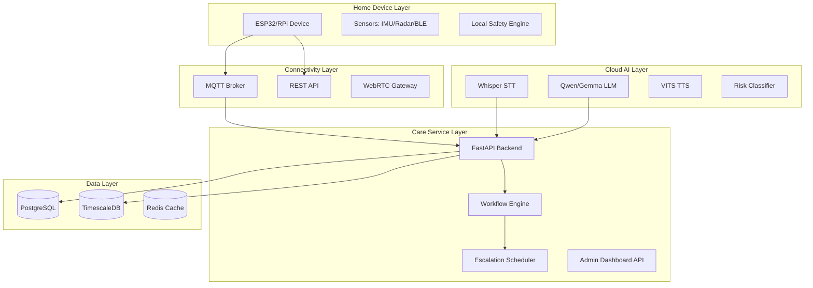
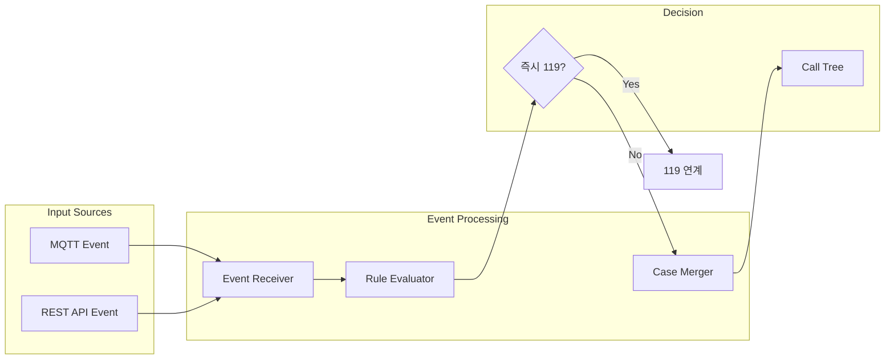

# AI Care Companion 백엔드 개발 계획

## 시스템 아키텍처 개요




---

## Phase 1: 프로젝트 초기화 및 DB 스키마

### 1.1 프로젝트 구조 설정

```
aiboocare/
├── backend/
│   ├── app/
│   │   ├── api/           # FastAPI 라우터
│   │   ├── core/          # 설정, 보안, 의존성
│   │   ├── models/        # SQLAlchemy 모델
│   │   ├── schemas/       # Pydantic 스키마
│   │   ├── services/      # 비즈니스 로직
│   │   ├── workers/       # 백그라운드 워커
│   │   └── main.py
│   ├── alembic/           # DB 마이그레이션
│   ├── tests/
│   └── requirements.txt
├── docker/
│   └── docker-compose.yml
├── docs/
└── History/               # 변경 이력 문서화
```

### 1.2 DB 스키마 설계 (PostgreSQL + TimescaleDB)

**사용자/기기 테이블:**

- `care_user`: 대상자 기본 정보 (UUID PK, 동의 상태 플래그)
- `care_user_pii`: PII 분리 저장 (AES-256-GCM 암호화)
- `care_device`: 기기 정보 (모델, 시리얼, 상태)

**이벤트/시계열 테이블:**

- `measurement`: TimescaleDB 하이퍼테이블 (혈압, SpO2, 활동량)
- `care_event`: 감지 이벤트 (낙상, 무활동, 응급버튼)

**워크플로우/알림 테이블:**

- `care_case`: 이벤트를 묶은 케이스 (티켓)
- `alert`: 발송 로직
- `notification_delivery`: 채널별 전송 상태
- `case_action`: 상태 변경 이력 (Audit Log)

**정책 룰 엔진 테이블:**

- `policy_bundle`: 정책 버전 관리
- `policy_threshold`: 센서 임계치
- `escalation_plan`: 콜 트리 단계 설정
- `policy_rule`: JSON Schema 기반 복합 조건 룰

### 1.3 보안 요구사항 반영

- PII 필드 암호화: `cryptography` 라이브러리 사용
- 암호화 키: 환경변수/Secret Manager
- 감사 로그: 모든 데이터 접근/변경 기록

---

## Phase 2: Policy REST API 구축

### 2.1 FastAPI 엔드포인트 설계

```
/api/v1/
├── /policies/
│   ├── /bundles           # 정책 번들 CRUD
│   ├── /thresholds        # 임계치 설정 CRUD
│   ├── /escalation-plans  # 콜 트리 설정 CRUD
│   └── /rules             # 복합 룰 CRUD (JSON Schema 검증)
├── /users/                # 대상자 관리
├── /devices/              # 기기 관리
└── /health                # 헬스체크
```

### 2.2 핵심 구현 사항

- Pydantic을 활용한 JSON Schema 검증 (`rule_json`, `action_json`)
- JWT/세션 기반 인증 (HttpOnly + Secure + SameSite 쿠키)
- Role 기반 접근 제어 (Admin/Operator/Guardian)
- OpenAPI(Swagger) 자동 문서화

---

## Phase 3: Event 및 Workflow Engine

### 3.1 이벤트 처리 흐름




### 3.2 핵심 로직 구현

- **케이스 병합**: 30분 내 동일 그룹 이벤트 병합
- **즉시 119 에스컬레이션 (Hard Rule)**:
  - 응급 키워드 발화
  - SpO2 < 90% 지속 + 호흡곤란
  - 낙상 후 60초 무동작
- **백그라운드 워커**: Celery 또는 asyncio 기반

---

## Phase 4: Escalation Scheduler (콜 트리)

### 4.1 단계적 에스컬레이션 구조


| Stage | 대상       | 타임아웃 |
| ----- | -------- | ---- |
| 1     | 보호자 1    | 60초  |
| 2     | 보호자 2    | 90초  |
| 3     | 요양보호사/기관 | 120초 |
| 4     | 관제센터/운영자 | 60초  |


### 4.2 구현 사항

- APScheduler 또는 Celery Beat 기반 스케줄러
- 타임아웃 만료 시 다음 Stage로 자동 에스컬레이션
- 모든 액션 `case_action` 테이블 기록
- ACK 응답 처리 로직

---

## 인프라 및 개발 환경

### Docker Compose 구성

- PostgreSQL 15 + TimescaleDB 확장
- Redis (캐싱/세션)
- MQTT Broker (Mosquitto)
- FastAPI 애플리케이션

### 테스트 전략

- 각 Phase별 단위/통합 테스트 코드 작성
- pytest + pytest-asyncio
- 테스트 DB 격리 (테스트용 PostgreSQL 컨테이너)

---

## 보안 체크리스트 (ISMS-P 수준)

- PII 암호화 저장 및 분리
- JWT HttpOnly/Secure 쿠키
- 입력 검증 (백엔드 필수)
- Role 기반 접근 제어
- 감사 로그 (Admin 액션 전체 기록)
- 시크릿 관리 (환경변수/Secret Manager)
- 로그에 민감정보 제외

