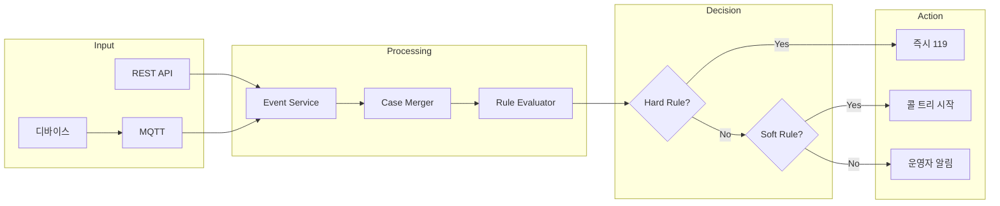

# Phase 3: Event Receiver 및 Workflow Engine 완료

**날짜**: 2026-03-04  
**작업자**: AI Assistant

## 완료된 작업

### 1. 이벤트/케이스 스키마 및 API

#### Event API (`/api/v1/events`)

| 엔드포인트 | 메서드 | 설명 |
|-----------|--------|------|
| `/events` | GET | 이벤트 목록 조회 |
| `/events/{id}` | GET | 이벤트 상세 조회 |
| `/events/{id}/status` | PATCH | 이벤트 상태 변경 |
| `/events/device` | POST | 디바이스에서 이벤트 전송 |

#### Case API (`/api/v1/cases`)

| 엔드포인트 | 메서드 | 설명 |
|-----------|--------|------|
| `/cases` | GET | 케이스 목록 조회 |
| `/cases/open/count` | GET | 열린 케이스 수 |
| `/cases/{id}` | GET | 케이스 상세 (이벤트/액션 포함) |
| `/cases/{id}/status` | PATCH | 케이스 상태 변경 |
| `/cases/{id}/assign` | POST | 담당자 지정 |
| `/cases/{id}/note` | POST | 노트 추가 |
| `/cases/{id}/escalate` | POST | 에스컬레이션 |
| `/cases/{id}/ack` | POST | ACK 처리 |

### 2. MQTT 이벤트 수신 워커

**토픽 구조:**
```
aiboocare/devices/{serial}/events       - 이벤트 수신
aiboocare/devices/{serial}/measurements - 측정 데이터 수신
aiboocare/devices/{serial}/status       - 상태/Heartbeat 수신
```

**기능:**
- aiomqtt 기반 비동기 MQTT 클라이언트
- 자동 재연결 (5초 간격)
- 이벤트 → 케이스 자동 생성/병합
- 측정값 이상 감지 → 이벤트 자동 생성
- Heartbeat 처리

**활성화:**
```bash
ENABLE_MQTT_WORKER=true uvicorn app.main:app
```

### 3. Rule Evaluator 및 Case Merger

#### 케이스 병합 로직
- **병합 키**: `(user_id, event_group, 30분 윈도우)`
- **이벤트 그룹**:
  - `safety`: 낙상, 무활동, 응급버튼
  - `vital`: 비정상 생체, 저산소증
  - `emergency`: 응급 키워드 발화

#### Hard Rules (즉시 119)
| 조건 | 트리거 |
|------|--------|
| 응급 키워드 발화 | "살려줘", "흉통", "호흡곤란" |
| SpO2 < 90% 지속 | 60초 이상 + 3개 연속 측정 |
| 낙상 후 무응답 | no_movement_after_fall / user_no_response |
| SOS 버튼 + 미응답 | emergency_button + user_no_response |

#### Soft Rules (콜 트리 시작)
| 조건 | 트리거 |
|------|--------|
| 낙상 감지 | fall_detected |
| 무활동 감지 | 15분+ 경고, 30분+ 심각 |
| 비정상 생체 | abnormal_vital_signs |
| 저산소증 | low_spo2 (non-sustained) |

#### 측정값 이상 자동 감지
| 측정 타입 | 임계값 | 심각도 |
|----------|--------|--------|
| SpO2 | < 90% | CRITICAL |
| SpO2 | < 94% | WARNING |
| 심박수 | < 40 또는 > 120 | WARNING |
| 심박수 | < 30 또는 > 150 | CRITICAL |

### 4. 응급 키워드 탐지기

```python
# EMERGENCY (즉시 119)
"살려줘", "흉통", "호흡곤란", "숨이 막혀", "119 불러줘"

# CRITICAL (콜 트리 시작)
"넘어졌어", "못 일어나", "어지러워", "도와줘"

# WARNING (확인 필요)
"몸이 안 좋아", "아파", "힘들어"
```

## 생성된 파일

### 스키마 (`app/schemas/`)
- `event.py` - 이벤트/케이스/측정/MQTT 스키마

### 서비스 (`app/services/`)
- `event.py` - EventService, CaseService, MeasurementService
- `rule_engine.py` - RuleEvaluator, EmergencyKeywordDetector

### 워커 (`app/workers/`)
- `mqtt_worker.py` - MQTT 이벤트 수신 워커

### API 엔드포인트 (`app/api/v1/endpoints/`)
- `events.py` - 이벤트/케이스 API

## 이벤트 처리 흐름



## 다음 단계

- **Phase 4**: Policy Engine & Call Tree 스케줄러
  - 정책 CRUD API
  - 콜 트리 타임아웃 스케줄러
  - 알림 서비스 연동
