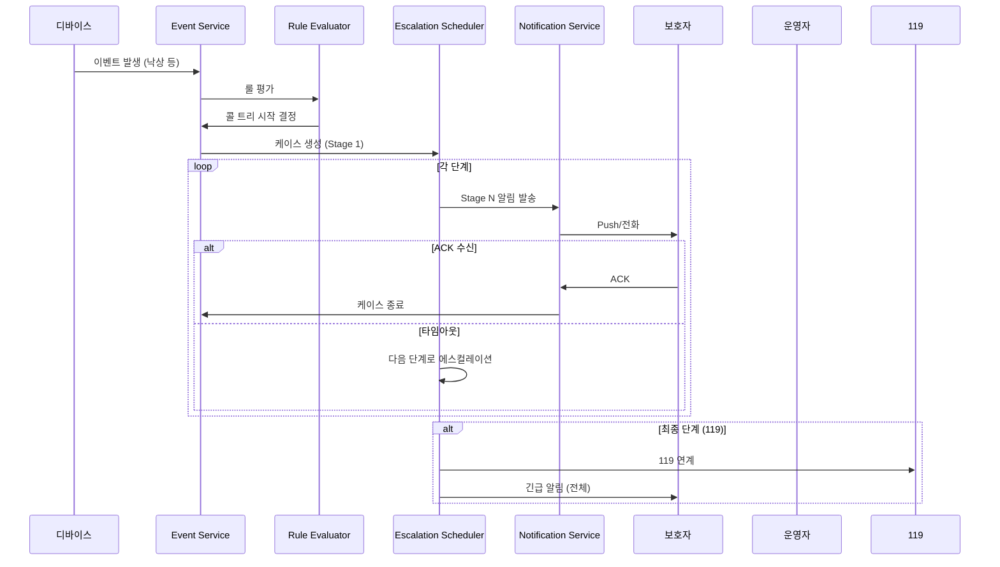

# Phase 4: Policy Engine & Call Tree 스케줄러 완료

**날짜**: 2026-03-04  
**작업자**: AI Assistant

## 완료된 작업

### 1. 정책 CRUD API (`/api/v1/policies`)

#### PolicyBundle API
| 엔드포인트 | 메서드 | 권한 | 설명 |
|-----------|--------|------|------|
| `/bundles` | GET | Operator+ | 번들 목록 조회 |
| `/bundles/active` | GET | Operator+ | 현재 활성 번들 조회 |
| `/bundles/{id}` | GET | Operator+ | 번들 상세 조회 |
| `/bundles` | POST | Admin | 번들 생성 (기본 설정 포함) |
| `/bundles/{id}` | PATCH | Admin | 번들 수정 |
| `/bundles/{id}/activate` | POST | Admin | 번들 활성화 |
| `/bundles/{id}` | DELETE | Admin | 번들 삭제 |

#### PolicyThreshold API
| 엔드포인트 | 메서드 | 설명 |
|-----------|--------|------|
| `/bundles/{id}/thresholds` | GET | 임계치 목록 조회 |
| `/thresholds` | POST | 임계치 생성 |
| `/thresholds/{id}` | PATCH | 임계치 수정 |
| `/thresholds/{id}` | DELETE | 임계치 삭제 |

#### EscalationPlan API
| 엔드포인트 | 메서드 | 설명 |
|-----------|--------|------|
| `/bundles/{id}/escalation-plans` | GET | 에스컬레이션 플랜 목록 |
| `/escalation-plans` | POST | 플랜 생성 |
| `/escalation-plans/{id}` | PATCH | 플랜 수정 |
| `/escalation-plans/{id}` | DELETE | 플랜 삭제 |

#### PolicyRule API
| 엔드포인트 | 메서드 | 설명 |
|-----------|--------|------|
| `/bundles/{id}/rules` | GET | 정책 룰 목록 |
| `/rules` | POST | 룰 생성 |
| `/rules/{id}` | PATCH | 룰 수정 |
| `/rules/{id}` | DELETE | 룰 삭제 |

### 2. 기본 정책 템플릿

#### 센서 임계치 (DEFAULT_THRESHOLDS)
| 측정 타입 | WARNING | CRITICAL | 단위 |
|----------|---------|----------|------|
| SpO2 | min: 94% | min: 90% | % |
| Heart Rate | 50~100 | 40~120 | bpm |
| Body Temp | 36.0~37.5 | 35.0~38.5 | °C |

#### 에스컬레이션 플랜 (DEFAULT_ESCALATION_PLANS)
| Stage | 이름 | 대상 | 타임아웃 | 채널 |
|-------|------|------|---------|------|
| 1 | 보호자 1차 | guardian | 60초 | push, call |
| 2 | 보호자 2차 | guardian | 90초 | push, call |
| 3 | 요양보호사/기관 | caregiver | 120초 | call, push |
| 4 | 관제센터/운영자 | operator | 60초 | call, console |
| 5 | 119 응급 | emergency | 0초 | api |

### 3. 콜 트리 타임아웃 스케줄러

**파일**: `app/workers/escalation_scheduler.py`

**동작:**
- 매 10초마다 에스컬레이션 대기 케이스 확인
- 타임아웃 초과 시 → 다음 단계로 자동 에스컬레이션
- 최종 단계 도달 시 → 119 연계
- 모든 액션은 CaseAction에 기록

**활성화:**
```bash
ENABLE_ESCALATION_SCHEDULER=true uvicorn app.main:app
```

### 4. 알림 서비스

**파일**: `app/services/notification.py`

**기능:**
- 에스컬레이션 알림 발송
- 대상별 알림 (Guardian, Caregiver, Operator, Emergency)
- 채널별 발송 (Push, SMS, Call, Console)
- 알림 ACK 처리
- 타임아웃 알림 처리

**알림 채널 (구현 예정):**
| 채널 | 설명 | 상태 |
|------|------|------|
| PUSH | FCM/APNs | 스텁 |
| SMS | 문자 메시지 | 스텁 |
| VOICE_CALL | TTS 전화 | 스텁 |
| EMAIL | 이메일 | 스텁 |
| KAKAO | 카카오톡 | 스텁 |

## 생성된 파일

### 스키마 (`app/schemas/`)
- `policy.py` - 정책 관련 스키마

### 서비스 (`app/services/`)
- `policy.py` - PolicyBundle/Threshold/Plan/Rule 서비스
- `notification.py` - 알림 서비스

### 워커 (`app/workers/`)
- `escalation_scheduler.py` - 콜 트리 스케줄러

### API 엔드포인트 (`app/api/v1/endpoints/`)
- `policies.py` - 정책 API

## 콜 트리 플로우



## 환경 변수 설정

```bash
# 워커 활성화
ENABLE_MQTT_WORKER=true
ENABLE_ESCALATION_SCHEDULER=true
```

## 다음 단계

- **Phase 5**: AI 서비스 통합
  - STT (음성→텍스트)
  - LLM (대화 처리)
  - TTS (텍스트→음성)
  - Risk Classifier (위험도 분류)
