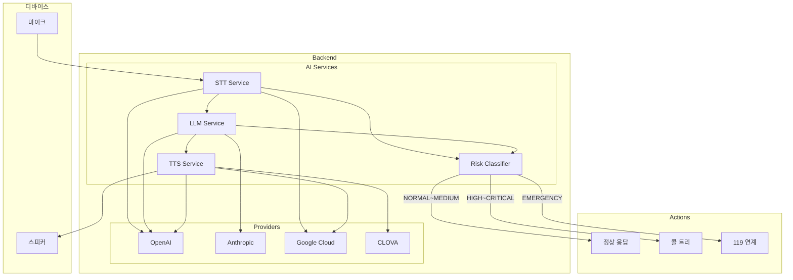

# Phase 5: AI 서비스 통합 완료

**날짜**: 2026-03-04  
**작업자**: AI Assistant

## 완료된 작업

### 1. STT (Speech-to-Text) 서비스

**파일**: `app/ai/stt.py`

| 프로바이더 | 모델 | 특징 |
|-----------|------|------|
| OpenAI | Whisper | 다국어, 높은 정확도 |
| Google Cloud | Speech-to-Text v1 | 실시간 스트리밍 지원 |

**API 엔드포인트:**
| 엔드포인트 | 메서드 | 설명 |
|-----------|--------|------|
| `/ai/stt` | POST | Base64 오디오 변환 |
| `/ai/stt/upload` | POST | 파일 업로드 변환 |

### 2. LLM (Language Model) 서비스

**파일**: `app/ai/llm.py`

| 프로바이더 | 모델 | 특징 |
|-----------|------|------|
| OpenAI | GPT-4o-mini | 빠른 응답, JSON 출력 |
| Anthropic | Claude 3.5 Sonnet | 긴 컨텍스트, 정확한 지시 |

**기능:**
- 대화 응답 생성
- 의도 분석 (ConversationIntent)
- 감정 분석 (happy, sad, anxious, pain, neutral)
- 응급 상황 감지 ([EMERGENCY], [ALERT] 태그)

**시스템 프롬프트 (아이부):**
- 독거노인 돌봄 AI 케어 동반자
- 따뜻하고 친근한 대화
- 건강 상태 자연스럽게 확인
- 응급 키워드 감지 시 태그 사용

**API 엔드포인트:**
| 엔드포인트 | 메서드 | 설명 |
|-----------|--------|------|
| `/ai/chat` | POST | 대화 처리 |
| `/ai/analyze-intent` | POST | 의도 분석 |

### 3. TTS (Text-to-Speech) 서비스

**파일**: `app/ai/tts.py`

| 프로바이더 | 모델 | 음성 | 특징 |
|-----------|------|------|------|
| OpenAI | TTS-1 | nova, alloy, echo 등 | 자연스러운 발음 |
| Google Cloud | WaveNet | ko-KR-Wavenet-A~D | 한국어 억양 |
| CLOVA | Premium | nara, nminsang 등 | 한국어 특화 |

**API 엔드포인트:**
| 엔드포인트 | 메서드 | 응답 |
|-----------|--------|------|
| `/ai/tts` | POST | 오디오 바이너리 또는 Base64 |

### 4. Risk Classifier (위험도 분류)

**파일**: `app/ai/risk_classifier.py`

**위험도 수준:**
| 레벨 | 설명 | 액션 |
|------|------|------|
| NORMAL | 정상 | 없음 |
| LOW | 낮음 | 로그 |
| MEDIUM | 중간 | 모니터링 |
| HIGH | 높음 | 보호자 알림 |
| CRITICAL | 위험 | 콜 트리 시작 |
| EMERGENCY | 응급 | 즉시 119 |

**감지 키워드:**

*응급 (EMERGENCY):*
- 살려줘, 흉통, 가슴이 아파, 호흡곤란, 숨이 막혀
- 쓰러졌어, 119, 구급차

*위험 (HIGH/CRITICAL):*
- 넘어졌어, 못 일어나, 도와줘
- 숨이 차, 어지러워서 못 움직여

**생체 데이터 임계값:**
| 측정 | EMERGENCY | CRITICAL | WARNING |
|------|-----------|----------|---------|
| SpO2 | < 85% | < 90% | < 94% |
| 심박수 | < 30 / > 160 | < 40 / > 130 | < 50 / > 110 |
| 체온 | - | < 35 / > 39 | < 36 / > 37.8 |

**API 엔드포인트:**
| 엔드포인트 | 메서드 | 설명 |
|-----------|--------|------|
| `/ai/risk-assessment` | POST | 종합 위험도 평가 |
| `/ai/health` | GET | AI 서비스 상태 확인 |

## 생성된 파일

### AI 모듈 (`app/ai/`)
- `__init__.py` - AI 서비스 패키지
- `base.py` - 기본 인터페이스 및 결과 타입
- `stt.py` - STT 서비스 (OpenAI, Google)
- `llm.py` - LLM 서비스 (OpenAI, Anthropic)
- `tts.py` - TTS 서비스 (OpenAI, Google, CLOVA)
- `risk_classifier.py` - 위험도 분류기

### API 엔드포인트 (`app/api/v1/endpoints/`)
- `ai.py` - AI 서비스 API

### 설정 추가 (`app/core/config.py`)
```python
# AI 서비스 설정
OPENAI_API_KEY: str
OPENAI_MODEL: str = "gpt-4o-mini"
OPENAI_STT_MODEL: str = "whisper-1"
OPENAI_TTS_MODEL: str = "tts-1"
OPENAI_TTS_VOICE: str = "nova"

ANTHROPIC_API_KEY: str
ANTHROPIC_MODEL: str = "claude-3-5-sonnet-20241022"

GOOGLE_APPLICATION_CREDENTIALS: Optional[str]
GOOGLE_CLOUD_PROJECT: Optional[str]

CLOVA_CLIENT_ID: str
CLOVA_CLIENT_SECRET: str

# 기본 프로바이더 선택
AI_STT_PROVIDER: str = "openai"
AI_LLM_PROVIDER: str = "openai"
AI_TTS_PROVIDER: str = "openai"
```

## 아키텍처



## 사용 예시

### STT + LLM + TTS 플로우

```python
# 1. 음성 → 텍스트
stt = get_stt_service("openai")
stt_result = await stt.transcribe(audio_data, language="ko")

# 2. 대화 처리
llm = get_llm_service("openai")
llm_result = await llm.chat(
    message=stt_result.text,
    user_context={"name": "홍길동", "age": 75}
)

# 3. 위험도 평가
classifier = RiskClassifier()
risk = await classifier.assess_risk(
    text=stt_result.text,
    vital_data={"spo2": 92, "heart_rate": 85}
)

# 4. 텍스트 → 음성
tts = get_tts_service("openai")
tts_result = await tts.synthesize(llm_result.response, voice="nova")
```

## 다음 단계

- **Phase 6**: 보호자 앱
  - Flutter/React Native 모바일 앱
  - 실시간 알림 수신
  - 케이스 ACK
  
- **Phase 7**: 디바이스 연동
  - ESP32/Raspberry Pi 펌웨어
  - 센서 데이터 수집
  - 음성 인터페이스
