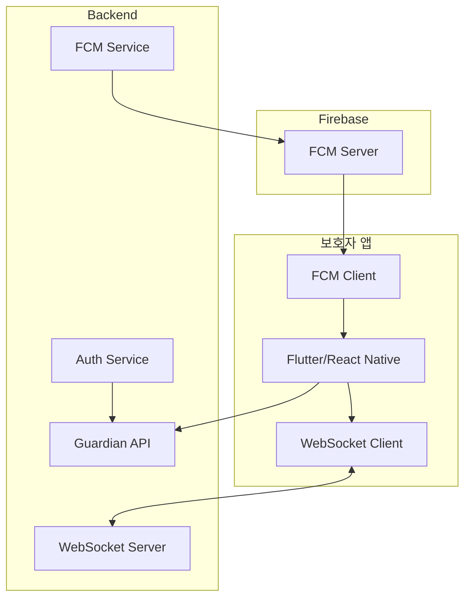

# Phase 6: 보호자 앱 백엔드 완료

**날짜**: 2026-03-04  
**작업자**: AI Assistant

## 완료된 작업

### 1. 보호자 인증 API

**파일**: `app/services/guardian_app.py`, `app/api/v1/endpoints/guardian_app.py`

| 엔드포인트 | 메서드 | 설명 |
|-----------|--------|------|
| `/guardian-app/login` | POST | 전화번호/비밀번호 로그인 |
| `/guardian-app/logout` | POST | 로그아웃 |
| `/guardian-app/refresh-token` | POST | 토큰 갱신 |
| `/guardian-app/change-password` | POST | 비밀번호 변경 |

**특징:**
- 전화번호 기반 인증 (암호화된 전화번호와 비교)
- HttpOnly 쿠키로 JWT 토큰 관리
- Refresh Token 해시 DB 저장
- 마지막 로그인 시간 기록

### 2. 보호자용 케이스/알림 API

| 엔드포인트 | 메서드 | 설명 |
|-----------|--------|------|
| `/guardian-app/cases` | GET | 케이스 목록 조회 |
| `/guardian-app/cases/{id}` | GET | 케이스 상세 조회 |
| `/guardian-app/cases/{id}/ack` | POST | 케이스 ACK |
| `/guardian-app/alerts` | GET | 알림 목록 조회 |
| `/guardian-app/alerts/read` | POST | 알림 읽음 처리 |
| `/guardian-app/alerts/unread-count` | GET | 읽지 않은 알림 수 |
| `/guardian-app/dashboard` | GET | 대시보드 |
| `/guardian-app/profile` | GET | 프로필 조회 |

**케이스 ACK 액션:**
- `acknowledged`: 확인함
- `on_the_way`: 가는 중
- `will_call`: 전화할 예정
- `delegate`: 다른 보호자에게 위임

### 3. WebSocket 실시간 알림

**파일**: `app/api/v1/endpoints/websocket.py`

| 엔드포인트 | 설명 |
|-----------|------|
| `/ws/guardian` | 보호자 WebSocket 연결 |
| `/ws/status` | WebSocket 상태 조회 |

**연결 방식:**
```javascript
// 쿼리 파라미터로 토큰 전달
const ws = new WebSocket('ws://host/api/v1/ws/guardian?token=xxx');

// 또는 첫 메시지로 인증
ws.send(JSON.stringify({ token: 'xxx' }));
```

**메시지 타입:**
| 타입 | 방향 | 설명 |
|------|------|------|
| `connected` | 서버→클라이언트 | 연결 성공 |
| `case_update` | 서버→클라이언트 | 케이스 업데이트 |
| `alert` | 서버→클라이언트 | 알림 |
| `ping`/`pong` | 양방향 | 연결 유지 |
| `ack` | 클라이언트→서버 | 알림 확인 |

### 4. FCM 푸시 알림

**파일**: `app/services/push_notification.py`

| 메서드 | 설명 |
|--------|------|
| `send_to_token()` | 단일 토큰 전송 |
| `send_to_tokens()` | 다중 토큰 전송 |
| `send_case_alert()` | 케이스 알림 |
| `send_escalation_alert()` | 에스컬레이션 알림 |

**알림 유형:**
| 이벤트 | 제목 | 내용 |
|--------|------|------|
| fall | 🚨 응급 상황 | {이름}님의 낙상이 감지되었습니다 |
| emergency_button | ⚠️ 위험 알림 | {이름}님이 응급 버튼을 눌렀습니다 |
| inactivity | ⚡ 주의 알림 | {이름}님의 무활동이 감지되었습니다 |
| abnormal_vital | ⚡ 주의 알림 | {이름}님의 생체 징후 이상이 감지되었습니다 |

## Guardian 모델 업데이트

**추가된 필드:**
```python
# 인증 관련
password_hash: str          # BCrypt 비밀번호 해시
refresh_token_hash: str     # Refresh Token 해시
fcm_token: str              # FCM 푸시 토큰
last_login_at: datetime     # 마지막 로그인
app_enabled: bool           # 앱 활성화 여부
```

## 생성된 파일

### 스키마
- `app/schemas/guardian_app.py`
  - GuardianLoginRequest/Response
  - FCMTokenRegisterRequest/Response
  - GuardianCaseResponse/DetailResponse
  - CaseAckRequest/Response
  - GuardianAlertResponse
  - GuardianDashboardResponse

### 서비스
- `app/services/guardian_app.py`
  - GuardianAuthService
  - GuardianCaseService
  - GuardianAlertService
  - GuardianDashboardService

- `app/services/push_notification.py`
  - FCMService

### API 엔드포인트
- `app/api/v1/endpoints/guardian_app.py`
- `app/api/v1/endpoints/websocket.py`

### 설정 추가
```python
# config.py
FCM_SERVER_KEY: str              # Firebase 서버 키
ENABLE_MQTT_WORKER: bool         # MQTT 워커 활성화
ENABLE_ESCALATION_SCHEDULER: bool # 스케줄러 활성화
```

## 아키텍처



## 환경변수 설정 (.env)

```bash
# FCM 푸시 알림
FCM_SERVER_KEY=AAAAxxx...  # Firebase 프로젝트 설정에서 획득

# 워커 설정
ENABLE_MQTT_WORKER=false
ENABLE_ESCALATION_SCHEDULER=false
```

## 사용 예시

### 보호자 앱 로그인 플로우

```typescript
// 1. 로그인
const response = await fetch('/api/v1/guardian-app/login', {
  method: 'POST',
  headers: { 'Content-Type': 'application/json' },
  body: JSON.stringify({ phone: '010-1234-5678', password: '1234' }),
  credentials: 'include',  // 쿠키 포함
});

// 2. FCM 토큰 등록
await fetch('/api/v1/guardian-app/fcm-token', {
  method: 'POST',
  headers: { 'Content-Type': 'application/json' },
  body: JSON.stringify({ fcm_token: 'xxx', device_type: 'android' }),
  credentials: 'include',
});

// 3. WebSocket 연결
const ws = new WebSocket(`ws://host/api/v1/ws/guardian?token=${token}`);
ws.onmessage = (event) => {
  const data = JSON.parse(event.data);
  if (data.type === 'alert') {
    // 알림 표시
    showNotification(data.data);
  }
};

// 4. 대시보드 조회
const dashboard = await fetch('/api/v1/guardian-app/dashboard', {
  credentials: 'include',
});
```

### 케이스 ACK

```typescript
await fetch(`/api/v1/guardian-app/cases/${caseId}/ack`, {
  method: 'POST',
  headers: { 'Content-Type': 'application/json' },
  body: JSON.stringify({
    action: 'on_the_way',  // acknowledged, on_the_way, will_call, delegate
    note: '지금 출발합니다',
  }),
  credentials: 'include',
});
```

## 다음 단계

- **Phase 7**: 디바이스 연동
  - ESP32/Raspberry Pi 펌웨어
  - 센서 데이터 수집
  - MQTT 통신
  - OTA 업데이트

- **Phase 8**: 원격진료 연계
  - Pre-triage 생성
  - 의료기관 API 연동
  - EMR 연계
