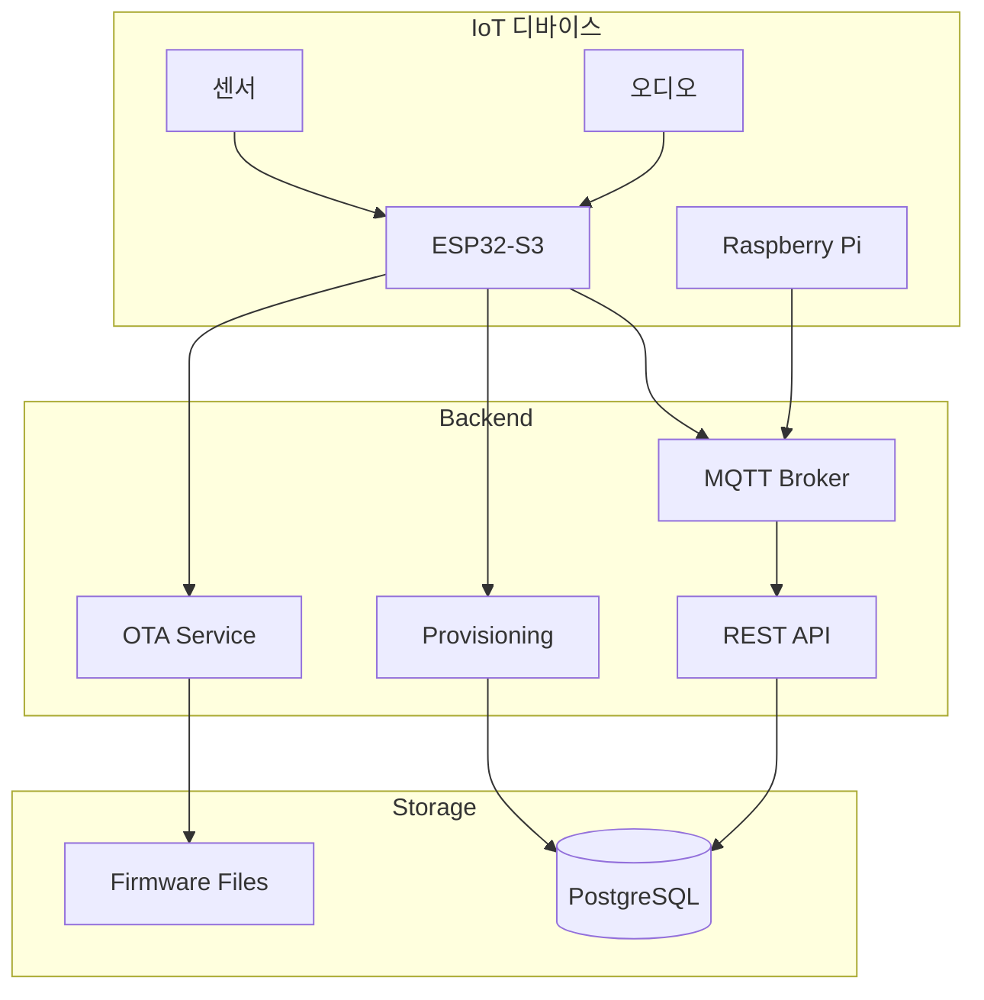

# Phase 7: 디바이스 연동 완료

**날짜**: 2026-03-04  
**작업자**: AI Assistant

## 완료된 작업

### 1. MQTT 토픽/메시지 프로토콜

**파일**: `app/device/mqtt_protocol.py`

**토픽 구조**:
| 패턴 | 방향 | QoS | 설명 |
|------|------|-----|------|
| `aiboo/{device_id}/telemetry/{type}` | 디바이스→서버 | 0 | 센서 데이터 |
| `aiboo/{device_id}/event/{type}` | 디바이스→서버 | 1 | 이벤트 |
| `aiboo/{device_id}/status` | 디바이스→서버 | 1 | 하트비트 |
| `aiboo/{device_id}/cmd/{cmd}` | 서버→디바이스 | 2 | 명령 |
| `aiboo/{device_id}/response/{cmd}` | 디바이스→서버 | 1 | 응답 |

**메시지 타입**:
- `TelemetryMessage`: 센서 데이터 (vital, activity, environment)
- `EventMessage`: 이벤트 (fall, emergency_button 등)
- `StatusMessage`: 하트비트/상태
- `CommandMessage`: 서버 명령
- `ResponseMessage`: 명령 응답

### 2. 디바이스 프로비저닝 API

**파일**: `app/device/provisioning.py`, `app/api/v1/endpoints/device_provision.py`

| 엔드포인트 | 메서드 | 설명 |
|-----------|--------|------|
| `/device-mgmt/provision` | POST | 디바이스 등록 |
| `/device-mgmt/verify-token` | POST | 토큰 검증 |
| `/device-mgmt/refresh-token` | POST | 토큰 갱신 |
| `/device-mgmt/config/{serial}` | GET | 설정 조회 |

**프로비저닝 플로우**:
```
1. 디바이스 부팅
2. POST /device-mgmt/provision (시리얼, 모델, 펌웨어 버전)
3. 토큰 발급 (30일 유효)
4. MQTT 연결 정보 수신
5. 초기 설정 수신
```

### 3. OTA 업데이트 API

**파일**: `app/device/ota.py`

| 엔드포인트 | 메서드 | 설명 |
|-----------|--------|------|
| `/device-mgmt/ota/check` | POST | 업데이트 확인 |
| `/device-mgmt/ota/status` | POST | 상태 보고 |
| `/device-mgmt/ota/firmware` | GET | 펌웨어 목록 (관리자) |
| `/device-mgmt/ota/batch-update` | POST | 일괄 업데이트 (관리자) |

**OTA 플로우**:
```
1. 디바이스: POST /ota/check (현재 버전)
2. 서버: 새 버전 정보 응답
3. 디바이스: 펌웨어 다운로드
4. 디바이스: MD5 검증
5. 디바이스: 설치 및 재부팅
6. 디바이스: POST /ota/status (완료/실패)
```

### 4. 디바이스 명령 API

| 엔드포인트 | 메서드 | 설명 |
|-----------|--------|------|
| `/device-mgmt/command/{serial}` | POST | 명령 전송 |
| `/device-mgmt/speak/{serial}` | POST | TTS 재생 |
| `/device-mgmt/reboot/{serial}` | POST | 재부팅 |
| `/device-mgmt/mqtt/topics` | GET | MQTT 토픽 문서 |

**명령 종류**:
- `config`: 설정 변경
- `reboot`: 재부팅
- `ota`: OTA 업데이트
- `speak`: TTS 재생
- `ping`: 연결 확인
- `calibrate`: 센서 캘리브레이션

### 5. 펌웨어 아키텍처 문서

**파일**: `docs/firmware_architecture.md`

**지원 하드웨어**:
- ESP32-S3: 저전력 센서 허브, 음성 인터페이스
- Raspberry Pi 4/5: AI 처리, 카메라

**센서 구성**:
- SpO2: MAX30102
- IMU: MPU6050
- 마이크: INMP441 (I2S)
- 스피커: MAX98357A (I2S)
- 카메라: Pi Camera (CSI)
- mmWave: 호흡/움직임 감지

## 생성된 파일

### 디바이스 모듈 (`app/device/`)
- `__init__.py` - 패키지 초기화
- `mqtt_protocol.py` - MQTT 프로토콜 정의
- `provisioning.py` - 프로비저닝 서비스
- `ota.py` - OTA 업데이트 서비스

### API 엔드포인트
- `app/api/v1/endpoints/device_provision.py`

### 문서
- `docs/firmware_architecture.md`

## 기본 디바이스 설정

```python
{
    # 텔레메트리
    "telemetry_interval_seconds": 30,
    "heartbeat_interval_seconds": 60,
    
    # 이벤트 감지
    "fall_detection_enabled": True,
    "fall_sensitivity": "medium",
    "inactivity_threshold_minutes": 30,
    "emergency_button_enabled": True,
    "emergency_voice_enabled": True,
    
    # 생체 모니터링
    "vital_monitoring_enabled": True,
    "vital_interval_seconds": 60,
    "spo2_warning_threshold": 94,
    "spo2_critical_threshold": 90,
    
    # 오디오
    "audio_enabled": True,
    "wake_word": "아이부",
    "tts_volume": 80,
    "stt_language": "ko-KR",
    
    # OTA
    "ota_check_interval_hours": 24,
    "ota_auto_update": False,
}
```

## 아키텍처



## 사용 예시

### 디바이스 프로비저닝

```python
# ESP32 펌웨어에서
import urequests as requests

response = requests.post(
    "https://api.aiboo.care/api/v1/device-mgmt/provision",
    json={
        "serial_number": "AIBOO-001-2026",
        "device_model": "esp32_s3",
        "firmware_version": "1.0.0",
        "hardware_spec": {
            "sensors": ["spo2", "imu", "mic"],
            "has_speaker": True,
        }
    }
)

data = response.json()
# data = {
#     "device_id": "...",
#     "token": "...",
#     "mqtt_config": {...},
#     "config": {...}
# }
```

### MQTT 이벤트 전송

```python
import json
from umqtt.simple import MQTTClient

client = MQTTClient(
    client_id="aiboo_AIBOO-001",
    server="mqtt.aiboo.care",
    user="AIBOO-001-2026",
    password=token,
)

# 낙상 이벤트 전송
event = {
    "device_id": "AIBOO-001-2026",
    "timestamp": "2026-03-04T12:00:00Z",
    "event_type": "fall",
    "severity": "critical",
    "data": {
        "impact_force": 2.5,
        "duration_ms": 150,
    }
}

client.publish(
    "aiboo/AIBOO-001-2026/event/fall",
    json.dumps(event),
    qos=1
)
```

## 다음 단계

- **Phase 8**: 원격진료 연계
  - Pre-triage 생성 API
  - 의료기관 연동
  - EMR 시스템 연계
