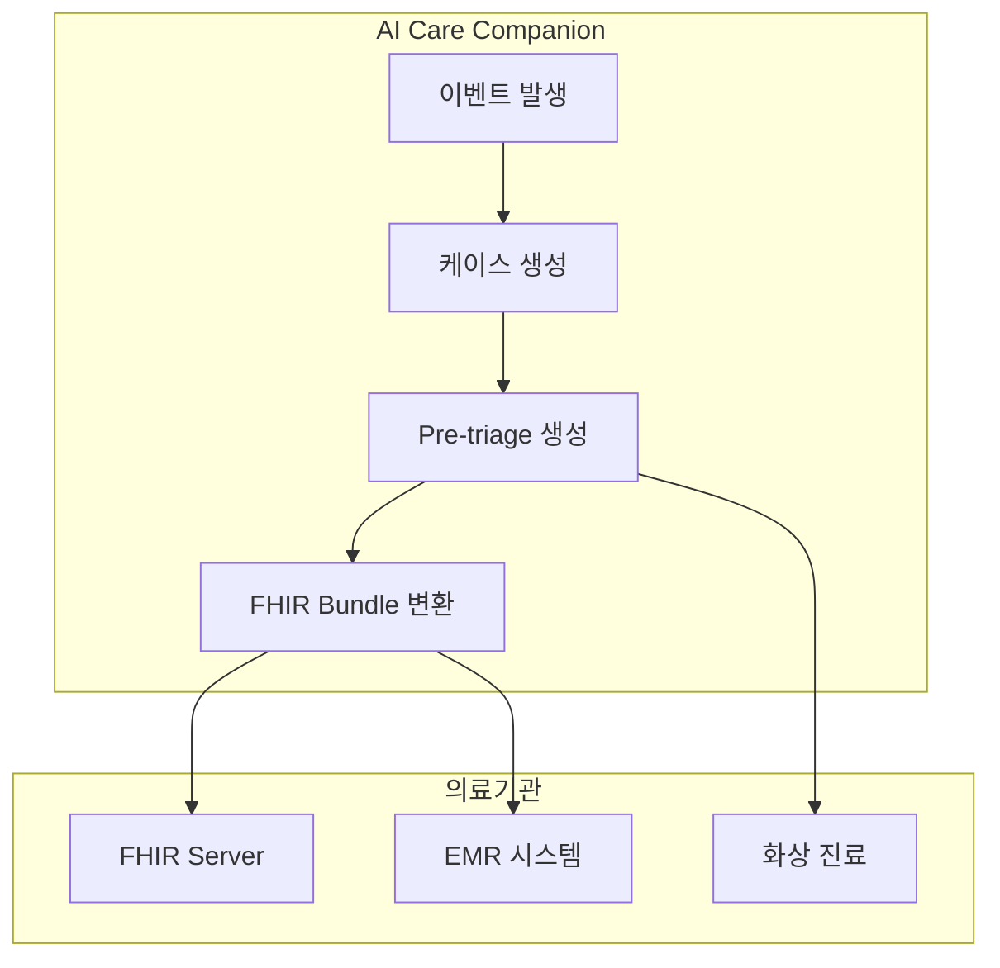

# Phase 8: 원격진료 연계 완료 (최종 단계)

**날짜**: 2026-03-04  
**작업자**: AI Assistant

## 완료된 작업

### 1. Pre-triage (사전분류) 모델

**파일**: `app/models/telemedicine.py`

**응급도 분류 (KTAS 기반)**:
| 레벨 | 이름 | 설명 | 응답시간 |
|------|------|------|----------|
| Level 1 | 소생 | 즉각적인 소생술 필요 | 즉시 |
| Level 2 | 응급 | 생명/사지 위협 | 10분 |
| Level 3 | 긴급 | 잠재적 위협 | 30분 |
| Level 4 | 준긴급 | 1-2시간 내 치료 | 60분 |
| Level 5 | 비긴급 | 급성 아님 | 120분 |

**Pre-triage 모델 필드**:
- `chief_complaint`: 주호소
- `history_present_illness`: 현재 병력
- `vital_signs`: 생체 징후 (JSON)
- `symptoms`: 증상 목록 (JSON)
- `past_medical_history`: 과거력
- `ai_assessment`: AI 분석 결과
- `fhir_bundle_id`: FHIR Bundle ID

### 2. FHIR R4 리소스 변환

**파일**: `app/telemedicine/fhir.py`

**지원 리소스**:
| 리소스 | 용도 | 코드 시스템 |
|--------|------|-------------|
| Patient | 환자 정보 | - |
| Observation | 생체 징후 | LOINC |
| Condition | 진단/증상 | ICD-10 |
| Appointment | 진료 예약 | SNOMED CT |
| Bundle | 리소스 묶음 | - |

**LOINC 코드 매핑**:
| 측정 항목 | LOINC 코드 | 단위 |
|----------|-----------|------|
| SpO2 | 59408-5 | % |
| 심박수 | 8867-4 | /min |
| 체온 | 8310-5 | Cel |
| 호흡수 | 9279-1 | /min |
| 수축기 혈압 | 8480-6 | mm[Hg] |
| 이완기 혈압 | 8462-4 | mm[Hg] |

### 3. Pre-triage 서비스

**파일**: `app/telemedicine/pretriage.py`

**기능**:
- `create_from_case()`: 케이스에서 자동 생성
- `create_manual()`: 운영자 수동 생성
- `to_fhir_bundle()`: FHIR Bundle 변환
- `_assess_urgency()`: KTAS 응급도 평가
- `_build_chief_complaint()`: 주호소 생성

### 4. 의료기관 연동 API

**파일**: `app/telemedicine/clinic_api.py`

**지원 연동 타입**:
- `fhir_server`: HL7 FHIR R4 서버
- `hospital_emr`: 병원 EMR 시스템
- `telemedicine_platform`: 화상 진료 플랫폼
- `pharmacy`: 약국

**API 기능**:
- `send_fhir_bundle()`: FHIR Bundle 전송
- `create_appointment()`: 진료 예약 생성
- `get_session_url()`: 화상 진료 URL 조회
- `check_clinic_availability()`: 예약 가능 확인

### 5. 원격진료 API 엔드포인트

**파일**: `app/api/v1/endpoints/telemedicine.py`

| 엔드포인트 | 메서드 | 설명 |
|-----------|--------|------|
| `/telemedicine/pre-triage` | POST | Pre-triage 생성 |
| `/telemedicine/pre-triage/from-case/{id}` | POST | 케이스에서 생성 |
| `/telemedicine/pre-triage/{id}` | GET | 조회 |
| `/telemedicine/pre-triage/{id}/fhir` | GET | FHIR Bundle 변환 |
| `/telemedicine/pre-triage/{id}/send` | POST | 의료기관 전송 |
| `/telemedicine/clinics/register` | POST | 의료기관 등록 |
| `/telemedicine/appointments` | POST | 예약 생성 |
| `/telemedicine/fhir/resources` | GET | FHIR 문서 |
| `/telemedicine/urgency-levels` | GET | KTAS 문서 |

## 생성된 파일

### 모델
- `app/models/telemedicine.py`
  - `PreTriage`: 사전분류 테이블
  - `TelemedicineSession`: 원격진료 세션
  - `MedicalRecordSync`: EMR 동기화

### 서비스
- `app/telemedicine/__init__.py`
- `app/telemedicine/fhir.py` - FHIR 변환기
- `app/telemedicine/pretriage.py` - Pre-triage 서비스
- `app/telemedicine/clinic_api.py` - 의료기관 API

### API
- `app/api/v1/endpoints/telemedicine.py`

## 아키텍처



## 사용 예시

### Pre-triage 생성 및 전송

```python
# 1. 케이스에서 Pre-triage 생성
POST /api/v1/telemedicine/pre-triage/from-case/{case_id}

# 2. FHIR Bundle 변환
GET /api/v1/telemedicine/pre-triage/{triage_id}/fhir

# 3. 의료기관 전송
POST /api/v1/telemedicine/pre-triage/{triage_id}/send
{
    "clinic_id": "clinic_001"
}
```

### FHIR Bundle 예시

```json
{
    "resourceType": "Bundle",
    "id": "...",
    "type": "collection",
    "timestamp": "2026-03-04T12:00:00Z",
    "entry": [
        {
            "resource": {
                "resourceType": "Patient",
                "id": "...",
                "name": [{"text": "홍길동"}],
                "birthDate": "1950-01-01"
            }
        },
        {
            "resource": {
                "resourceType": "Observation",
                "code": {"coding": [{"code": "59408-5", "display": "SpO2"}]},
                "valueQuantity": {"value": 95, "unit": "%"}
            }
        },
        {
            "resource": {
                "resourceType": "Condition",
                "code": {"coding": [{"code": "W19", "display": "낙상"}]},
                "severity": {"coding": [{"display": "Moderate"}]}
            }
        }
    ]
}
```

## 전체 프로젝트 완료 요약

```
Phase 1: 인프라 구축         ✅ 완료
Phase 2: Core REST API       ✅ 완료
Phase 3: Event & Workflow    ✅ 완료
Phase 4: Policy & Call Tree  ✅ 완료
Phase 5: AI 서비스 통합      ✅ 완료
Phase 6: 보호자 앱           ✅ 완료
Phase 7: 디바이스 연동       ✅ 완료
Phase 8: 원격진료 연계       ✅ 완료 (최종)
```

## 참고 자료

- **FHIR R4**: https://www.hl7.org/fhir/R4/
- **KTAS**: 한국형 응급환자 분류도구
- **LOINC**: https://loinc.org/
- **ICD-10**: https://www.who.int/classifications/icd/
- **SNOMED CT**: https://www.snomed.org/

## 다음 단계 (운영/배포)

1. **테스트**: 단위 테스트, 통합 테스트 실행
2. **마이그레이션**: Alembic으로 DB 마이그레이션
3. **환경 설정**: 운영 환경 시크릿 설정
4. **배포**: Docker Compose 또는 Kubernetes
5. **모니터링**: 로깅, 알림 설정
